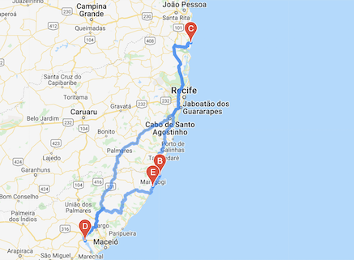

# world_weather_analysis

## Project Overview

The goal of this project was to help a tech company called PlanMyTrip to develop real-time suggestions for client's ideal hotels for vacation.

The criteria to identify the ideal hotels was:
1. Cities that had the right kind of weather for the client
2. Hotels that were within a given range of latitude and longitude 

## Results

In order to filter the data for the weather preferences, input statements were added so the user can add the minimum and maximum desired temperatures(F°). 
For this project the chosen range was 75°F to 90°F. This range was then used to create a list of potential travel destinations and nearby hotels. From this list, four cities that were possible to travel from/to each other by car were chosen by the user to create the travel itinerary.
Finally, using the Google Maps Directions API, a travel route and a marker layer map were created.

### Vacation Search

- The dataFrame shown bellow represents part of the list of potential travel destinations and nearby hotels.

- On the following image the red markers represent all the destinations around the globe that fell inside the set parameters. 

### Travel Destinations

- The following DataFrame contains the four chosen destinations with their respective maximum temperature, weather characteristics and coordinates.

- On the image bellow the 4 destinations are highlighted. By clicking on each red marker, a popup is displayed with additional information.

### Travel Route

- The highlighted route below connects all four cities. It starts and ends in Pilar, Brazil.

